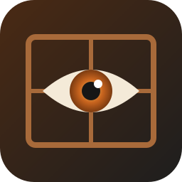

# gaze



**Looking out onto the web. A keyboard-driven browser in Rust, around WebKitGTK.**

   

gaze is a small shell around the WebKit engine, the way qutebrowser is a shell around Chromium. Keys work like vim and qutebrowser, and every key is a command you can rebind. Tabs group, fold and come back with the session the way Firefox does it. Logins live in one encrypted file and fill a login page as it loads. Ads and trackers are blocked from a hosts list. The shell itself does nothing while you read. Part of the [Fe₂O₃ Rust terminal suite](https://github.com/isene/fe2o3).

## Keys

Press `?` inside gaze for the full list, with the keys as they are bound right now.

| Key | Does |
|---|---|
| `o` / `O` | Open a URL or a search here / in a new tab (`go`, `gO` start from the current URL) |
| `f` / `F` | Hints: type the letters on a link to follow it / open it in a background tab |
| `H` / `L` | Back / forward |
| `r` | Reload |
| `j` `k` `h` `l`, `gg`, `G`, `Ctrl-d` / `Ctrl-u`, `Space` | Scroll |
| `/`, `n` / `N` | Find on the page |
| `i`, `gi` | Insert mode (type into the page) / focus the first field. `Esc` leaves |
| `yy`, `pp` / `PP` | Copy the URL; open what the clipboard holds here / in a new tab |
| `t`, `d`, `u` | New tab, close tab, bring back the last closed |
| `Left` / `Right`, `J` / `K`, `Alt-1`…`Alt-9` | Previous / next tab, tab by number |
| `Shift-Left` / `Shift-Right` | Move the tab left / right |
| `zc` / `zo` / `za` | Fold / unfold / toggle the current tab's group; `zM` and `zR` do all |
| `M`, `gb` / `gB` | Bookmark this page; the bookmark list here / in a new tab |
| `gp` | Fill the login form; again for the next saved login of the site |
| `:` | Command line |
| `Q`, `ZZ` | Quit |

`:bind <keys> <command>` changes a binding from the command line and `:unbind <keys>` drops one. The changes go to `~/.gaze/keys.yml`, which you can also edit by hand. Key names follow qutebrowser: plain characters as they are, else `<Ctrl-d>`, `<Alt-1>`, `<Shift-Left>`, `<Space>`, `<Backspace>`.

## Tab groups

`:group work` puts the current tab in the group *work*, made on the spot when it is new. Each group has a colour and shows as a coloured run in the tab bar. A tab opened from a grouped tab joins the group. `zc` folds the group away, and `J`/`K` skip its tabs until `zo` unfolds it. `:ungroup`, `:group-rename <name>`, `:group-color <colour>` (blue red yellow green pink purple orange cyan gray), `:group-close` and `:groups` do what they say. Groups come back with the session at the next start.

## Passwords

Logins live in `~/.gaze/passwords`, one file sealed with ChaCha20-Poly1305 under a key that Argon2id makes from a master password. You choose the master password the first time gaze needs the file. It is asked once per session; `:password-lock` locks again.

- A login page gets filled when it loads, with the login you used last on that site. `gp` cycles through the others.
- After you log in with a new or changed password, gaze asks whether to save it: `y` or `n`.
- A site's HTTP password dialog is answered from the store too, when it is open.
- `:passwords` lists the sites and usernames. Passwords themselves are never shown.
- `:password-import ~/logins.csv` reads the file Firefox writes from `about:logins` → Export Logins. Delete the CSV afterwards.

## Bookmarks

`M` bookmarks the page; `gb` shows the list, where `f` and the letters open one. `:bookmark-del` forgets the current page. `:bookmark-import ~/bookmarks.html` reads the file Firefox writes from Manage Bookmarks → Import and Backup → Export Bookmarks to HTML. The list is `~/.gaze/bookmarks`, one URL, a tab and a title per line.

## Ad blocking

On by default; `adblock: false` in the config turns it off. The first start fetches [Steven Black's hosts list](https://github.com/StevenBlack/hosts) to `~/.gaze/adblock/hosts` and compiles it into a WebKit content filter, which takes a few seconds once. Every domain on the list is then blocked for every request. `:adblock-update` fetches the list again.

## Install

```bash
sudo apt install libwebkitgtk-6.0-dev libgtk-4-dev   # Debian / Ubuntu
cargo install --path .
```

Runtime: WebKitGTK 6.0 and GTK 4. To make gaze the browser other programs open links in, copy `share/gaze.desktop` to `~/.local/share/applications/` and run `xdg-settings set default-web-browser gaze.desktop`. A second `gaze <url>` opens the URL in the running window.

## Files

- `~/.gaze/config.yml`: home page, search engine (`%s` is the query), download folder, zoom, scroll step, ad blocking.
- `~/.gaze/keys.yml`: the key bindings you changed.
- `~/.gaze/bookmarks`: the bookmarks, one per line.
- `~/.gaze/session.json`: the open tabs and groups, written when they change and read at start. Only the current tab loads at start; the others load when you go to them.
- `~/.gaze/passwords`: the sealed logins.
- `~/.gaze/adblock`: the hosts list and the compiled filter.
- `~/.gaze/data`, `~/.gaze/cache`: cookies, local storage and the cache, kept by WebKit.

## License

Public domain (Unlicense).
