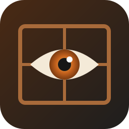

# gaze



**Looking out onto the web. A keyboard-driven browser in Rust, around WebKitGTK.**

   

gaze is a small shell around the WebKit engine, the way qutebrowser is a shell around Chromium. Keys work like vim and qutebrowser, and every key is a command you can rebind. Tabs group, fold and come back with the session the way Firefox does it. Logins live in one encrypted file and fill a login page as it loads. Ads and trackers are blocked from a hosts list. The shell itself does nothing while you read. Part of the [Fe₂O₃ Rust terminal suite](https://github.com/isene/fe2o3).

## Keys

Press `?` inside gaze for the full list, with the keys as they are bound right now.

| Key | Does |
|---|---|
| `o` / `O` | Open a URL or a search here / in a new tab (`go`, `gO` start from the current URL). The prompt offers pages from your history and bookmarks; `Tab` picks one. A keyword first picks the search engine: `w rust` asks Wikipedia (see Search engines) |
| `f` / `F` | Hints: type the letters on a link to follow it / open it in a background tab |
| `H` / `L`, `Ctrl-Left` / `Ctrl-Right` | Back / forward in this tab's history |
| `r` | Reload |
| `j` `k` `h` `l`, `gg`, `G`, `Ctrl-d` / `Ctrl-u`, `Space` | Scroll |
| `/`, `n` / `N` | Find on the page |
| `Ctrl-f` | Only the page: hide the tab bar and the status line; again to bring them back |
| `D` | Dark pages on or off for this site, kept for next time (see Dark pages) |
| `gr` | Reader view: the article alone, without menus and side columns; again for the page as it was (see Reader view) |
| `Ctrl-p` / `Ctrl-P` | Print the page / save it as a PDF in the download folder, named by its title (see Print and PDF) |
| `Alt-m` | Sound off or on for this tab. `♪` in the tab bar marks a tab that plays sound, `♪✕` one that is switched off. `:mute 3` does it for tab 3 |
| `i`, `gi` | Insert mode (type into the page) / focus the first field. A click on a field enters it too; `Tab` moves to the next field; `Esc` leaves |
| `Ctrl-g` | In a text field: its text opens in your editor, in a new terminal window, and comes back into the field when you close it (`editor` in the config, `scribe` unless you change it; never a password field) |
| `yy`, `pp` / `PP` | Copy the URL; open what the clipboard holds here / in a new tab |
| `t`, `d`, `u` | New tab, close tab, bring back the last closed |
| `T` | New private tab (see Private tabs) |
| `Left` / `Right`, `J` / `K`, `Alt-1`…`Alt-9` | Previous / next tab, tab by number |
| `Shift-Left` / `Shift-Right` | Move the tab left / right |
| `zc` / `zo` / `za` | Fold / unfold / toggle the current tab's group; `zM` and `zR` do all |
| `M`, `gb` / `gB` | Bookmark this page; the bookmark list here / in a new tab |
| `gp` | Fill the login form; again for the next saved login of the site |
| `v` | Play this page's video in `mpv` (see Video) |
| `Ctrl-a` | A Claude session about the page, in a new terminal window (`claude` on the PATH; the terminal is `terminal` in the config, `glass --` unless you change it). In insert mode `Ctrl-a` still selects the field's text |
| `:` | Command line |
| `Q`, `ZZ` | Quit |

`Tab` completes on the command line: command names, then group names after `:group` and colours after `:group-color`. `:bind <keys> <command>` changes a binding from the command line and `:unbind <keys>` drops one. The changes go to `~/.gaze/keys.yml`, which you can also edit by hand. Key names follow qutebrowser: plain characters as they are, else `<Ctrl-d>`, `<Alt-1>`, `<Shift-Left>`, `<Space>`, `<Backspace>`.

## Tab groups

`:group work` puts the current tab in the group *work*, made on the spot when it is new. Each group has a colour and shows as a coloured run in the tab bar. A tab opened from a grouped tab joins the group. `zc` folds the group away, and `J`/`K` skip its tabs until `zo` unfolds it. `:ungroup`, `:group-rename <name>`, `:group-color <colour>`, `:group-close` and `:groups` do what they say. A colour is a name (blue red yellow green pink purple orange cyan gray) or `#rrggbb`.

A group with no tabs stays, dimmed at the end of the bar, until `:group-delete`. Groups come back with the session at the next start, and the config can name groups that exist from the start:

```yaml
groups:
  - {name: Work, color: "#5faf87"}
  - {name: Home, color: orange}
```

## Private tabs

`T` opens a private tab, marked ⊘ in the tab bar. `:private <url>` does the same.

- It is in no history and no session file, and `u` does not bring it back.
- It does not see the cookies of your other tabs. Private tabs share theirs, in memory only.
- A tab opened from a private tab is private too: a link, a popup, a URL you type there.
- When the last private tab closes, its cookies, cache and site data go with it.
- No login is filled or offered for saving. `gp` still fills one when you ask.
- What you ask gaze to keep is kept: a download, a bookmark, a dark or microphone choice for the site.

A private tab keeps your visit off this machine. The site and your network still see your address.

## Passwords

Logins live in `~/.gaze/sync/passwords`, one file sealed with ChaCha20-Poly1305 under a key that Argon2id makes from a master password. You choose the master password the first time gaze needs the file. It is asked once per session; `:password-lock` locks again.

- A login page gets filled when it loads, with the login you used last on that site. `gp` cycles through the others.
- After you log in with a new or changed password, gaze asks whether to save it: `y` or `n`.
- A site's HTTP password dialog is answered from the store too. With the store locked, gaze asks for the master password first; `Esc` there gives you the dialog to type in.
- In that dialog the keys are its own: type, `Tab` to the password, `Enter`. `Esc` closes it. A login typed there gets the same question.
- `:passwords` lists the sites and usernames. Passwords themselves are never shown.
- `:password-master` asks for a new master password, twice, and seals the file under it. Unlock first (`gp`).
- `:password-import ~/logins.csv` reads the file Firefox writes from `about:logins` → Export Logins. gaze deletes the CSV after a successful import.

## The phone

gaze has a phone half in [nomad](https://github.com/isene/nomad/tree/master/apps/gaze). The two share `~/.gaze/sync/` through Syncthing: the passwords, the bookmarks and the tabs sent across. The first start of gaze 0.3.28 moves the passwords and the bookmarks in there from `~/.gaze/`.

`:send` opens the page you are on in gaze on the phone. A page the phone sends opens here as a background tab, and the status line says so.

Both sides read a changed file again before they write it. A login saved on the phone survives one saved here a minute later.

## History and bookmarks

`o` on its own lists the pages you were at last. Typing narrows the list to pages whose URL or title holds every word you typed, bookmarks (★) first. `Tab` and `Shift-Tab` put one on the line and `Return` opens it. Visits are kept in `~/.gaze/history`, the last five thousand pages.

`M` bookmarks the page; `gb` shows the list, where `f` and the letters open one. `:bookmark-del` forgets the current page. `:bookmark-import ~/bookmarks.html` reads the file Firefox writes from Manage Bookmarks → Import and Backup → Export Bookmarks to HTML. The list is `~/.gaze/sync/bookmarks`, one URL, a tab and a title per line.

## Ad blocking

On by default; `adblock: false` in the config turns it off. The first start fetches [Steven Black's hosts list](https://github.com/StevenBlack/hosts) to `~/.gaze/adblock/hosts` and compiles it into a WebKit content filter, which takes a few seconds once. Every domain on the list is then blocked for every request. `:adblock-update` fetches the list again.

## The microphone and the camera

A call page needs both, and no page gets them without being asked for.

`:mic` lets the site you are on use the microphone and the camera, and remembers it. Typing it again takes them back. The list is `~/.gaze/mic`, one site per line.

A site that asks and is not on the list is refused, and the status line says which site asked. The page is reloaded when you answer, since a page only asks once.

A page also has to be the tab you are looking at. A call in a background tab waits for you to come back to it, which is the browser's own rule, not gaze's.

## The ad blocker and the page you asked for

Everything a page pulls in is blocked against the hosts list: images, scripts, styles, fonts, media, requests.

The page you asked for never is. A hosts list holds click trackers, and a password reset arrives through one. Discord sends you to `click.discord.com`, which is on the list. Blocking it leaves you looking at nothing, with no idea why.

## Which chip draws the page

The one built into the processor, by default. `GAZE_CPU=1` hands it back to the processor itself, for a machine whose graphics are the weaker of the two.

Measured on a heavy page, 200 bullets and 320 table rows over a gradient: forty scroll steps cost 1.38 s of processor time the old way and 1.01 s the new one. Page loads cost the same either way.

gaze also refuses to wake a discrete card, which is watts for nothing on a browser.

## Dark pages

On by default; `dark: false` in the config turns it off.

`D` turns dark pages on or off for the site you are on, and remembers it. A site you have set keeps its answer on every later visit. Everything else follows the default. `:dark-default` flips that default, and the sites you set keep theirs.

Every site is asked for its dark style first, the way a dark desktop asks. A site that has one uses its own colours. A site with none is turned around instead. The page is inverted and the hues turned back, then pictures and video are inverted a second time. Text goes light on dark, blue links stay blue, photos keep their colours.

A picture set as an element's background is no ``. CSS cannot ask for one, so gaze looks for them as the page settles. A box big enough to hold a picture is turned back. A small one is an icon, part of the writing, and turns with it. A picture behind the whole page is turned back on its own. What sits on it is then turned once more, so the page stays dark.

Turning a page around is a blunt tool. A dark band on an otherwise light page comes out light, so a site with a dark header looks odd. `D` gets you out of it.

It costs something: about a fifth more work in the page for a big article, since every layer is painted twice.

## Reader view

`gr` shows the article alone: its text, pictures and links in one column, without menus, side columns and share boxes. `gr` again brings the page back as it was.

gaze finds the article by its paragraphs: the part of the page with most of the running text wins. On a page with no such part gaze says so and leaves the page as it is. `f` follows the links in the article. The colours follow your dark setting.

## Print and PDF

`Ctrl-p` opens the print dialog. `Ctrl-P` saves the page as a PDF in the download folder, named by the page's title. `:pdf <file>` names the file yourself. A name that is taken gets `-2`, then `-3`.

A page gaze has turned dark is printed in its own light colours. A site that is dark by its own style prints dark. Reader view always prints black on white, so `gr` first gives a clean light PDF of any article.

`paper: a4` in the config sets the paper: `a3`, `a4`, `a5`, `letter` or `legal`. Left out, it follows the language settings of your system.

## Search engines

A keyword in front of what you type picks the search engine: `w free will` asks Wikipedia. Three are there from the start: `w` for Wikipedia, `yt` for YouTube and `gh` for GitHub.

The list is `engines:` in the config, a keyword and a URL per line, with `%s` where your words go. Your own list replaces the three, and `engines: {}` turns them off. A keyword alone is a word like any other.

## Video

A video page goes to `mpv` instead of the browser: a click on a YouTube link, a typed or pasted address, a link opened in a new tab. YouTube's own pages stay in gaze; only the watch pages leave. `v` sends the page you are on to `mpv`, for a video you reached inside YouTube itself. `mpv` plays YouTube through `yt-dlp`, and it costs about half the battery of the same video in a browser. Keep `yt-dlp` current. An old one is refused by YouTube, and then nothing happens at all: `mpv` starts, fails and exits.

`video_player` in the config names the program, empty keeps videos in gaze, and `video_urls` lists how a video page's address starts.

## Mail links

A `mailto:` link opens no tab. It goes to the program named as `mail` in the config, with the link as its last argument. The default is `kastrup --draft`, which queues a draft with the link's address, subject and text; `+` in kastrup opens it. `xdg-open` hands the link to the desktop's mail program instead.

## Spare web processes

WebKitGTK 2.52 starts a spare web process after each page from a new site, then neither uses nor ends it. Each is 58 MB and wakes once a second; a day of browsing left 37 of them. gaze ends its own web processes that are still under 80 MB after a minute, when a page finishes loading or a tab closes. A process that has shown a page is 150 MB or more, so no page is touched.

## Graphics

gaze draws pages on the processor, not on the graphics chip, and sets that for itself at startup.

A page is a great many small paints, and each one pays the driver again. On an Intel laptop through a plain X server, one load of a long article costs gaze 2.4 to 4.0 seconds on the processor and 11.4 to 12.5 on the chip. Video is the other way round, and video does not come through here: it goes to the player.

`GAZE_GPU=1` hands the drawing back to the chip. That is the right choice on a desktop with a compositor, where the picture never comes back over the bus.

## Install

```bash
sudo apt install libwebkitgtk-6.0-dev libgtk-4-dev   # Debian / Ubuntu
cargo install --path .
```

Runtime: WebKitGTK 6.0 and GTK 4. Pages are painted on the graphics chip built into the processor, and a discrete card is never woken. `GAZE_CPU=1` paints them on the processor instead, for a machine whose graphics are worse. Where the desktop asks every program for GTK's `cairo` renderer, gaze uses `ngl` for itself. The frames then stay on the chip: a moving page costs 38% of a core instead of 307%. gaze also drops `gl` from `GDK_DISABLE` for itself. With GL switched off that way, WebKit crashes on pages with video. `GAZE_KEEP_GDK_DISABLE=1` leaves the variable alone. To make gaze the browser other programs open links in, copy `share/gaze.desktop` to `~/.local/share/applications/` and run `xdg-settings set default-web-browser gaze.desktop`. A second `gaze <url>` opens the URL in the running window.

## Files

- `~/.gaze/config.yml`: the settings. Home page, search engines, download folder, paper size, zoom and scroll step. Ad blocking, dark pages, text size of the bars (`font_size`, in pixels) and standing groups.
- `~/.gaze/keys.yml`: the key bindings you changed.
- `~/.gaze/sync/`: shared with the phone through Syncthing. `passwords` (the sealed logins), `bookmarks` (one per line), and `tabs/` (the tabs sent across, one file each).
- `~/.gaze/dark`: the sites where dark pages differ from the default, one `<site> on` or `<site> off` per line.
- `~/.gaze/history`: one line per visit, folded to one entry per page when read.
- `~/.gaze/session.json`: the open tabs and groups, written when they change and read at start. Only the current tab loads at start; the others load when you go to them.
- `~/.gaze/adblock`: the hosts list and the compiled filter.
- `~/.gaze/data`, `~/.gaze/cache`: cookies, local storage and the cache, kept by WebKit.
  Cookies are accepted from any site, third parties too: Google's sign-in hands you to YouTube through one, and refusing it ends on YouTube's "oops" page.

## License

Public domain (Unlicense).
